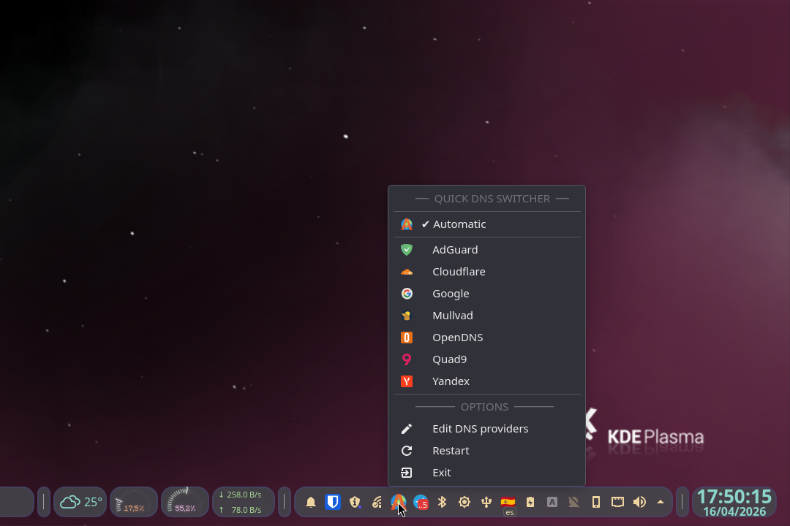
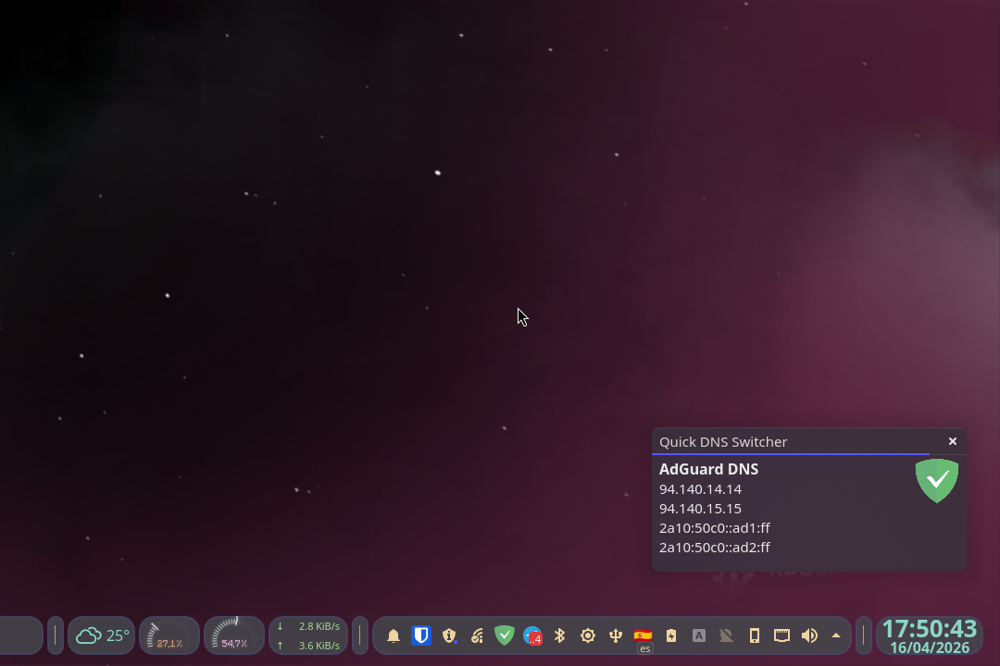
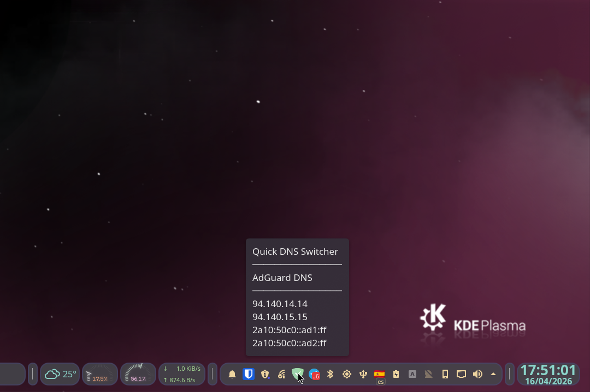
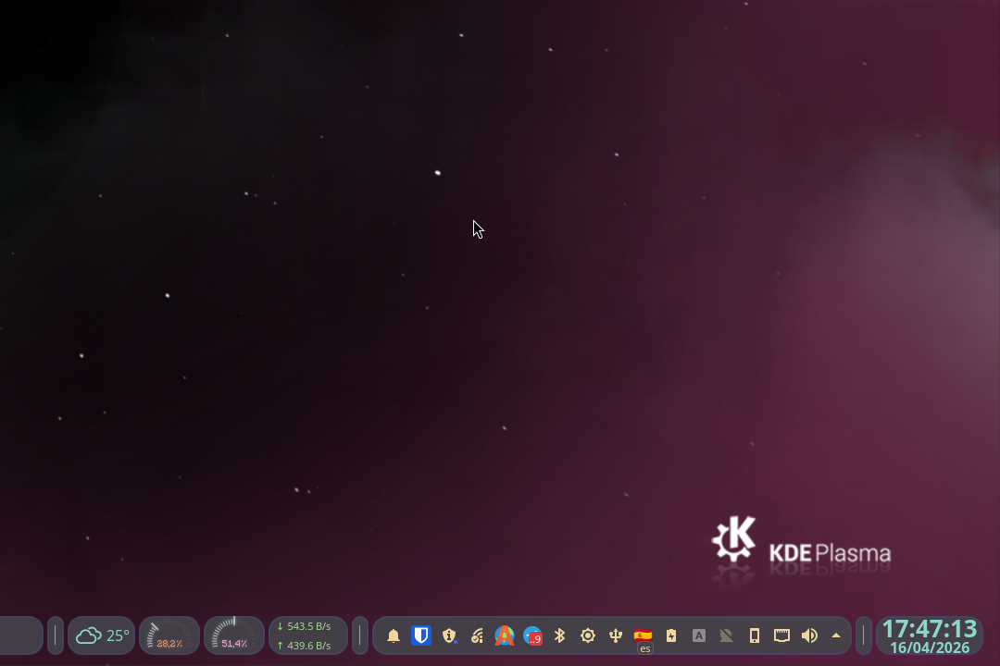

# Quick DNS Switcher


[](https://networkmanager.dev)
[](https://python.org)
[](https://doc.qt.io/qtforpython-6)
[](LICENSE)

A lightweight system tray application that allows you to **quickly change between configured DNS providers** in just two clicks.

Built with PyQt6, it supports both IPv4 and IPv6 DNS servers and runs without root permissions on GNU/Linux platforms with NetworkManager as network configuration tool suite.




## Features
- **Fast DNS change**: Switch your DNS settings in just 2 clicks from the system tray.
- **No root needed**: App can be installed as user/system application and does not require root permissions to work. 
- **All interfaces at once**: DNS changes will be applied to all real network interfaces (WiFi and Ethernet). 
- **IPv4 & IPv6 support**: Full dual-stack compatibility.
- **Real-time Monitoring**: Automatically detects network changes and updates DNS status.
- **System Tray Integration**: Runs silently in background with minimal resource usage.
- **Cross-Platform**: Supports Linux (via NetworkManager).
- **Notifications**: Desktop notifications when DNS settings change.
- **Multiple DNS providers**: Pre-configured with 7 popular DNS providers:
  - Cloudflare
  - Google
  - Quad9
  - AdGuard
  - OpenDNS
  - Mullvad
  - Yandex
- **Customizable**: Easy to personalize or add custom DNS providers via JSON configuration.


## Requirements
### System Requirements
- **Linux**: NetworkManager with `nmcli` command-line tool
- **Python 3.8+**

### Python Dependencies
- PyQt6
- python-dbus


## Installation

### From AUR

Install [Quick DNS Switcher from AUR](https://aur.archlinux.org/packages/quick-dns-switcher):

   ```bash
   yay -S quick-dns-switcher
   ```


### From Source

1. **Download project**:

    It's desirable to download latest release from Github page, but you are free to clone the repository if you want.

    ```bash
   git clone https://github.com/gmm96/Quick-DNS-Switcher.git
   cd Quick-DNS-Switcher
   ```

2. **Run installation script**:
    - As system application. Required dependencies will be installed if needed.

        ```bash
        sudo bash install.sh
        ```

    - As user application. Required dependencies must be installed manually before.

        ```bash
        bash install.sh
        ```


## Uninstall

### From AUR
   ```bash
   yay -R quick-dns-switcher
   ```

### From Source

> [!CAUTION]
> Do not use this method if you installed it using AUR!

- As system application.

    ```bash
    sudo bash /opt/quick-dns-switcher/uninstall.sh
    ```

- As user application.

    ```bash
    bash ~/.local/opt/quick-dns-switcher/uninstall.sh
    ```


## Configuration
DNS providers are configured in ```dns_providers.json```.Providers must follow next format in configuration file:

```json
{
    "Provider Name":
    {
        "ipv4_1": "primary_ipv4_address",
        "ipv4_2": "secondary_ipv4_address", 
        "ipv6_1": "primary_ipv6_address",
        "ipv6_2": "secondary_ipv6_address",
        "icon": "icon_name"
    }
}
```

Icon field must be a icon name from your system theme.


### Adding a custom DNS provider:

- Right click on app icon in system tray.
- Select ```Edit DNS providers``` from context menu to open configuration file.
- Add a new entry following the format above and save.
- Restart application using ```Restart``` app menu option.
- Your custom provider will now appear in the menu.


## Support
Any issues? Questions?
1. Read this document.
2. Search existing issues.
3. Create a new issue with detailed info (include details like OS version, Python version, error messages, etc.).


## License
This project is licensed under the GNU General Public License v3.0. See the [LICENSE](LICENSE) file for details.


## Screenshots







